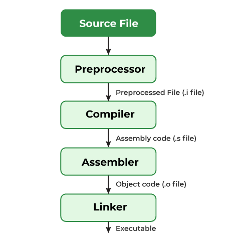

# C Basics
## Components of a C Program
1. Header Files Inclusion

    - `stddef.h` - Defines several useful types and macros.
    - `stdint.h` - Defines exact width integer types.
    - `stdio.h` - Defines core input and output functions.
    - `stdlib.h` - Defines numeric conversion functions, pseudo-random number generator, and memory allocation.
    - `string.h` - Defines string handling functions.
    - `math.h` - Defines common mathematical functions.
2. Main Method Declaration
3. Body of Main Method
4. Statement
5. Return Statement

## Compiling a C Program: Behind the Scenes
- The C program goes through the following phases during compilation:


By executing the below command, we get all intermediate files in the current directory along with the executable.
```shell
gcc -Wall -save-temps filename.c -o filename
```

## C Comments
1. Single-line comment
```c
// Single-line comment
```
2. Multi-line comment
```c
/* Multi-line comment */
```

## C Tokens
1. Keywords
```text
auto        double      int         struct
break       else        long        switch
case        enum        register    typedef
char        extern      return      union
const       float       short       unsigned
continue    for         signed      void
default     goto        sizeof      volatile
do          if          static      while
```

2. Identifiers
    - Identifiers must begin with a letter or underscore(_).
    - Identifiers must consist of only letters, digits, or underscore.No other character is allowed.
    - Identifiers should not be a keyword.
    - Identifiers must not contain white space.

3. Constants
```c
const int c_var = 20;
const int* const ptr = &c_var;
```

4. Strings
```c
char string[10] = {'s', 't', 'r', 'i', 'n', 'g', '\0' };
char string[10] = "string";
char string[] = "string";
```

5. Special Symbols
    - Brackets[]
    - Parentheses()
    - Braces{}
    - Comma(,)
    - Colon(:)
    - Semicolon(;)
    - Asterisk(*)
    - Assignment operator(=)
    - Pre-processor(#)
    - Period(.)
    - Tilde(~)

6. Operators
    - Arithmetic Operators(算术运算符)
    - Relational Operators(关系运算符)
    - Logical Operators(逻辑运算符)
    - Assignment Operators(赋值运算符)
    - Bitwise Operators(按位运算符)